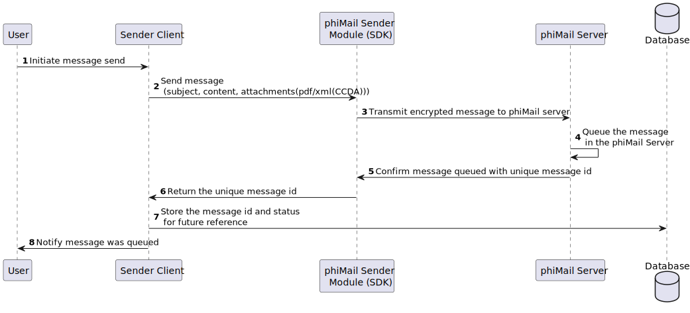
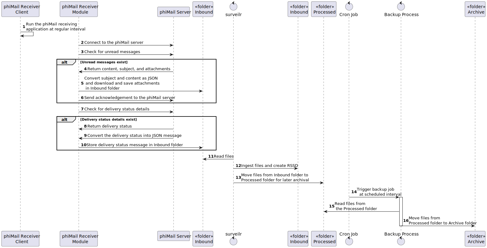

# Direct Messaging Service

This project is designed to facilitate the secure exchange of clinical data using the phiMail service.
The project comprises four main modules, each serving a distinct purpose within the overall system.
These modules work together to send, receive, process, and analyze clinical messages in a secure and efficient manner.

# PhiMail Overview

PhiMail is a secure messaging service that facilitates the exchange of protected health information (PHI) in compliance with healthcare regulations like HIPAA. It is designed to support healthcare providers, organizations, and other stakeholders in securely transmitting health-related data, ensuring both privacy and integrity.

# Key Features

Compliance with HIPAA: PhiMail ensures that all communications involving PHI meet the stringent requirements of the Health Insurance Portability and Accountability Act (HIPAA). This includes encryption of data in transit, secure storage, and proper handling of sensitive information.

DIRECT Protocol Support: PhiMail is built on the DIRECT protocol, a standardized method for secure email communication in healthcare. This enables seamless and secure transmission of health information between different systems and organizations, such as hospitals, laboratories, and physician offices.

Encryption and Security: PhiMail utilizes robust encryption mechanisms to protect data, ensuring that only authorized parties can access the information. This includes the use of SSL/TLS for secure connections and digital signatures to verify the authenticity of messages.

Interoperability: PhiMail supports interoperability with various healthcare systems, enabling the exchange of data in different formats like CDA (Clinical Document Architecture). This allows for smooth integration with electronic health records (EHR) systems and other health information exchanges (HIEs).

Message Tracking and Acknowledgments: PhiMail provides detailed tracking of message delivery, including delivery status and read receipts. This is crucial in healthcare settings, where confirmation of receipt and action on health-related messages is often required.

Scalability and Customization: PhiMail can be tailored to the specific needs of healthcare organizations, whether they require a standalone messaging solution or integration with existing systems. It is scalable to accommodate the needs of small practices as well as large healthcare networks.

Secure Attachments: PhiMail supports the secure exchange of attachments, such as medical records, lab results, and other documents. These attachments are encrypted and can be managed securely within the platform.

# Use Cases

Clinical Communication: Facilitates the exchange of medical records, referrals, and other critical health information between providers, ensuring timely and secure communication.

Laboratory Results: Enables labs to send results directly to providers, integrating seamlessly with EHR systems for quick access.

Patient Communication: Allows healthcare providers to securely send and receive information directly with patients, such as test results, care instructions, or appointment reminders.

# Message Sender Module

The Message Sender Module is responsible for sending direct messages containing clinical data.
This module ensures that the messages are securely transmitted to the intended recipients using the phiMail service.



# Message Receiving Module

The Message Receiving Module handles the secure receipt of direct messages from various direct messaging service providers.
It ensures that the incoming messages are appropriately processed and stored for further analysis.



# `surveilr` Direct Messaging Service Patterns

- `stateless-dms.surveilr.sql` script focuses on creating views that define how
  to extract and present specific direct messaging data from the `uniform_resource.content`
  JSONB column. It does not modify or store any persistent data; it only sets up
  views for querying.
- `orchestrate-stateful-dms.surveilr.sql` script is responsible for creating
  tables that cache data extracted by views. These tables serve as "materialized
  views", allowing for faster access to the data but are static. When new data
  is ingested, the tables need to be dropped and recreated manually, and any
  changes in the source data will not be reflected until the tables are
  refreshed.

## Try it out on any device without this repo (if you're just using the SQL scripts)

Prepare the ingest directory with received files using Message Receiving Module, download
`surveilr`, and create `resource-surveillance.sqlite.db` RSSD file that will
contain queryable Message Service data.

```bash
# download surveilr using instructions at https://docs.opsfolio.com/surveilr/how-to/installation-guide
$ ./surveilr ingest files -r ingest/

# apply the DMS views and create cached tables directly from GitHub
$ curl -L https://raw.githubusercontent.com/opsfolio/resource-surveillance-commons/main/pattern/direct-messaging-service/stateless-dms.surveilr.sql | sqlite3 resource-surveillance.sqlite.db

$ curl -L https://raw.githubusercontent.com/opsfolio/resource-surveillance-commons/main/pattern/direct-messaging-service/orchestrate-stateful-dms.surveilr.sql | sqlite3 resource-surveillance.sqlite.db

# use SQLPage to preview content (be sure `deno` v1.40 or above is installed)
$ deno run https://raw.githubusercontent.com/opsfolio/resource-surveillance-commons/main/prime/ux.sql.ts | sqlite3 resource-surveillance.sqlite.db

$ deno run https://raw.githubusercontent.com/opsfolio/resource-surveillance-commons/main/pattern/direct-messaging-service/ux.sql.ts | sqlite3 resource-surveillance.sqlite.db

$ surveilr web-ui --port 9000
# launch a browser and go to http://localhost:9000/dms/index.sql
```

Once you ingest all the files using `surveilr`, apply
`orchestrate-stateful-dms.surveilr.sql` and `stateless-dms.surveilr.sql` all
content will be accessed through views or `*.cached` tables in
`resource-surveillance.sqlite.db`.

At this point you can rename the SQLite database file, archive it, use in
reporting tools, DBeaver, DataGrip, or any other SQLite data access tools.

## Try it out in this repo (if you're developing SQL scripts)

First prepare the directory with sample files:

The directory should look like this now:

```
.
├── ingest
│   ├── 00000191-31c8-a179-d9f7-ae67ed7c3b80_20240808171502355_sample.xml
|   ├── 20240808171534044_messageDeliveryStatus.json
│   ├── 00000191-31c8-a179-d9f7-ae67ed7c3b80_20240808171502355_content.json
│   └── 00000191-31c8-a179-d9f7-ae67ed7c3b80_20240808171502355_sample.pdf
├── orchestrate-stateful-dms.surveilr.sql
└── stateless-dms.surveilr.sql
```

Now
[Download `surveilr` binary](https://docs.opsfolio.com/surveilr/how-to/installation-guide/)
into this directory, then ingest and query the data:

```bash
# ingest the files in the "ingest/" directory, creating resource-surveillance.sqlite.db
$ ./surveilr ingest files -r ingest/
```

After ingestion, you will only work with these files:

```
├── orchestrate-stateful-dms.surveilr.sql
├── stateless-dms.surveilr.sql
└── resource-surveillance.sqlite.db            # SQLite database
```

Post-ingestion, `surveilr` is no longer required, the `ingest` directory can be
ignored, only `sqlite3` is required because all content is in the
`resource-surveillance.sqlite.db` SQLite database which does not require any
other dependencies.

```bash
# load the "Console" and other menu/routing utilities
$ deno run ../../prime/ux.sql.ts | sqlite3 resource-surveillance.sqlite.db
$ deno run ./ux.sql.ts | sqlite3 resource-surveillance.sqlite.db

# apply the "stateless" DMS utility views
$ cat stateless-dms.surveilr.sql | sqlite3 resource-surveillance.sqlite.db

# optionally create `*_cached` tables ("materialized views") to improve performance
$ cat orchestrate-stateful-dms.surveilr.sql | sqlite3 resource-surveillance.sqlite.db

# if you want to start surveilr embedded SQLPage in "watch" mode to re-load files automatically
$ ../../support/bin/sqlpagectl.ts dev --watch . --watch ../../prime
# browse http://localhost:9000/ to see web UI

# if you want to start a standalone SQLPage in "watch" mode to re-load files automatically
$ ../../support/bin/sqlpagectl.ts dev --watch . --watch ../../prime --standalone
# browse http://localhost:9000/ to see web UI

# browse http://localhost:9000/dms/info-schema.sql to see DMS-specific
```

Once you apply `orchestrate-stateful-dms.surveilr.sql` and
`stateless-dms.surveilr.sql` you can ignore those files and all content will be
accessed through views or `*.cached` tables in
`resource-surveillance.sqlite.db`. At this point you can rename the SQLite
database file, archive it, use in reporting tools, DBeaver, DataGrip, or any
other SQLite data access tools.

## Automatically reloading SQL when it changes

On sandboxes during development and editing of `.sql` or `.sql.ts` you may want
to automatically re-load the contents into SQLite regularly. Since it can be
time-consuming to re-run the same command in the CLI manually each time a file
changes, you can use _watch mode_ instead.

See: [`sqlpagectl.ts`](../../support/bin/sqlpagectl.ts).

