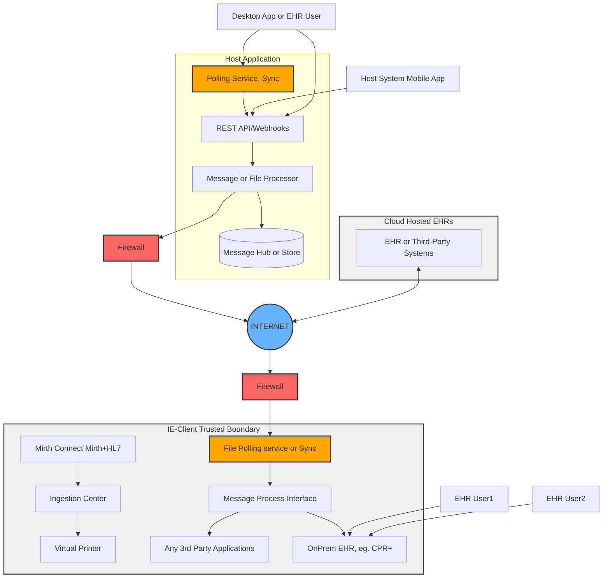
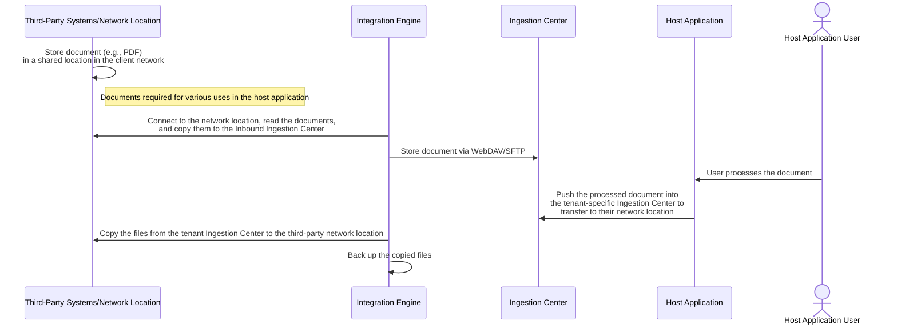
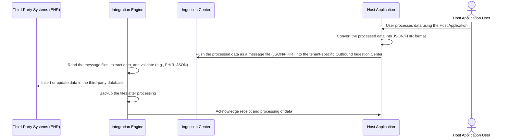
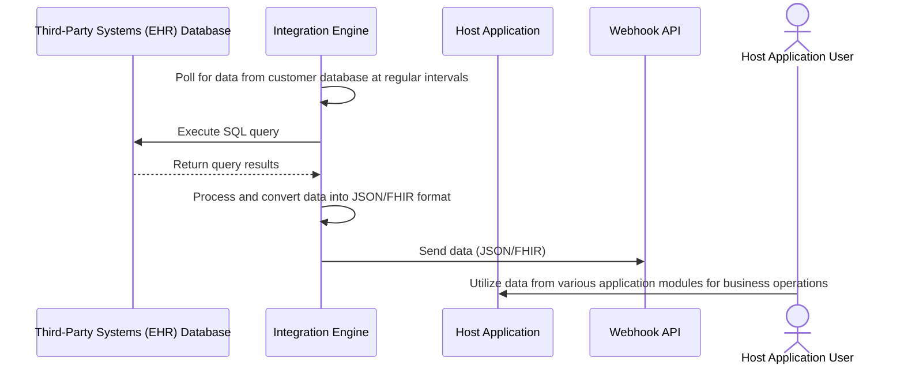

# Resource Surveillance Integration Engine (`RSIE`) for Local-first Edge-based Data Preparation 

### Table of Contents

- [Introduction to Resource Surveillance Integration Engine (RSIE)](#introduction-to-the-integration-engine-ie)
- [Electronic Data Exchange Overview](#electronic-data-exchange-overview)
- [Integration Engine (IE) features and use cases](#integration-engine-ie-features-and-use-cases)
- [Features and Capabilities](#features-and-capabilities)
- [Message Handling](#message-handling)
- [Technical Summary](#technical-summary)
  - [Components Breakdown](#components-breakdown)
    - [1. **Host application platform and its components**](#1-host-application-platform-and-its-components)
    - [2. **Host Application Platform Sync or Message Polling Server (WebDAV Protocol)**](#2-host-application-platform-sync-or-message-polling-server-webdav-protocol)
    - [3. **Message Processing module**](#3-message-processing-module)
    - [4. **Firebase**](#4-firebase)
    - [5. **Internet and Firewalls**](#5-internet-and-firewalls)
    - [6. **EHR OnPrem and Cloud Hosted**](#6-ehr-onprem-and-cloud-hosted)
    - [7. **Ingestion Center and Virtual Printer**](#7-ingestion-center-and-virtual-printer)
    - [8. **Mirth Connect + HL7**](#8-mirth-connect--hl7)
    - [9. **Samba Server**](#9-samba-server)
    - [10. **Sequelize ORM**](#10-sequelize-orm)
    - [11. **EHR, Practice Management, EMR, Billing Systems**](#11-ehr-practice-management-emr-billing-systems)
- [Various Use Cases and Sequence Diagrams](#various-use-cases-and-sequence-diagrams)
  - [File Exchange with Third-Party Systems/Network Locations](#file-exchange-with-third-party-systemsnetwork-locations)
  - [Outbound Message Integration with Third-Party Database](#outbound-message-integration-with-third-party-database)
  - [Integration with Third-Party Databases and Webhooks](#integration-with-third-party-databases-and-webhooks)
- [Resource surveillance (surveilr)](#resource-surveillance-surveilr)

## Introduction to the Resource Surveillance Integration Engine (RSIE)

The **Resource Surveillance Integration Engine (RSIE)** is a stateful data
preparation and integration platform for multiple systems that need to integrate
and  operate on common data in a local-first, edge-based manner.

- Stateful means that the RSIE is not just passing data between multiple sytems
  but allows storing the data in an opinionated universal schema with full SQL
  querying support.
- Local-first means that content should be prepared and processed locally
  _before_ going to a cloud or central server.
- Edge-based means that data should be handled as close to where the data is
  collected rather than everything being done centrally.

A typical use for RSIE's stateful, local-first, edge-based is for complex
medical data integration tasks. While RSIE can help with almost any integration
tasks, RSIE is particularly useful to help integrate **clinical operations 
data**, **patient data**, **pharmacy** and **billing information** to and from
multiple systems.

RSIE supports a variety of technologies to ensure smooth communication and data
transfer. It provides opinionated architecture and design guidance for file placement
in designated ingestions folders using technologies like **WebDAV**, **SFTP**, and 
**virtual printers**. It works with various message formats including **HL7**, **FHIR**,
**JSON**, and **XML**, while also supporting file types such as **CSV**,
**Excel**, and custom formats. The module can connect directly to customer
systems via **SQL** for database-level exchanges, and it integrates with webhook
APIs to trigger actions based on data retrieved from third-party databases.

In addition to simplifying data exchange processes, RSIE's local-first, stateful, 
edge-based architecture helps reduce sensitive data exposure (HIPAA-compliance)
by allowing data to be anonymized or deidentified before going to central servers.

The Integration Engine operates through a small, yet powerful and easy manageable application that resides on any device like a phone, workstations and laptop PCs, or servers in the cloud with highly secure environment. Its primary role is to collect data from the host systems (the
system where the data originates), and securely transmit designated third-party systems, it also collect/process data from the third party system and transfer the same to the source systems in a secure way. This process is fundamental to ensuring
that sensitive healthcare data is shared safely and efficiently across different platforms.

## Electronic Data Exchange Overview

**Integration Engine (IE)** utilizes a secure and reliable data exchange method,
ensuring that all patient information is transmitted in compliance with industry
standards. The system supports:

1. **Clinical Operating and Patient Data**: This requires managing patient data
   for various uses within the **Digital Health Technology Solution** to support
   ultimate patient care, coordination, and other operational tasks to ensure
   smooth delivery of services and patient satisfaction.

2. **Patient medication and continuity of care (COC) Data**: Facilitating the
   exchange of patient treatment plans, progress notes, and other clinical
   information with the partner EHR system and also transfer of patient
   demograhics and billing, progress notes and other information which is
   required to do the various steps/activities in the clinical workflows.

3. **Patient Billing/Pharmacy, refill Information**: Data exchange belongs to
   this category deals with the exchang of data related to
   medication/prescription, delivery of medicine and various billing and forms
   data generated by the practice systems and also those data which is transferred from the third-party EHR systems to streamline the activities involves in the patient care.

4. **Data exchange standards for interoperability**: In order to ensure a universal data standard, **Integration Engine** uses the common message standard for the exchange of data whcih include, HL7, FHIR, JSON, XML, CSV,PDF,XLS and direct exachage with the use of Webhooks/APIs between
   practices systems and third-party systems.

The integration of these data types within practice systems will enhance the efficiency and effectiveness of through an integrated platform,ensuring that patient care is delivered with the highest level of accuracy and security and high level of patient satisfaction benefiting from real-time data exchange that
supports high-quality patient care.

## Integration Engine (IE) features and use cases

The Integration Engine (IE) module handles message exchanges between the systems
it operates on and third-party systems. The expected features the engine suppors
are given below,

| Features/Uses                         | Details                                                                                                                                                                                                                                                                                                     |
| ------------------------------------- | ----------------------------------------------------------------------------------------------------------------------------------------------------------------------------------------------------------------------------------------------------------------------------------------------------------- |
| Ingestion Center                      | Capable of placing files in the ingestion center's Inbound and Outbound folders using technologies such as WebDAV, SFTP, and virtual printer capabilities.                                                                                                                                                  |
| Message format/standard Support       | The Integration Engine primarily supports message standards like HL7, FHIR, JSON, and XML but can also handle a variety of file types for exchange, such as CSV, Excel, or custom formats. This includes tasks like sending tenant-specific SQL dumps for application-specific data to third-party systems. |
| Direct SQL access to Customer systems | Supports connecting to customer or client systems' databases via SQL to facilitate information exchange between applications                                                                                                                                                                                |
| Webhooks                              | Able to invoke various webhook APIs of the application where the Integration Engine is used to transmit data retrieved from the third-party database, enabling further processing within different application modules.                                                                                     |

## Features and Capabilities

- **Document Exchange:**

  - Both **inbound** and **outbound** document exchanges are supported, with
    WebDAV and SFTP protocols. Virtual printer **capability** is optionally
    supported.

- **Third-Party Integration:**

  - The Ingestion Center facilitates two-way document exchange between the
    application utilizing the Integration Engine and various third-party
    applications, primarily different EHR (Electronic Health Records) systems.

- **Security and Compliance:**

  - The Ingestion Center securely exchanges documents and complies with HIPAA
    regulations.

- **Ease of Setup:**

  - The Ingestion Center allows for easy setup and file transfer using network
    mounting with WebDAV or other methods.

- **Tenant-Specific Configuration:**

  - Each Ingestion Center is identified with a unique ID, username, and
    password, ensuring that the centers are tenant-specific and enabling secure
    file sharing with simple file copy methods, requiring minimal technical
    knowledge.

- **Advanced Integration:**

  - Advanced features are also supported, such as integration with Mirth-based
    HL7 platforms or IoT integration platforms.

- **Custom Workflows:**
  - Custom workflows can be developed using workflow engine tools like Node-RED
    (or other programming platforms) and integrated with the Integration Engine
    (IE) codebase for extended functionality.

## Message Handling

- **Message Transfer Support:**

  - The Ingestion Center supports transferring various types of messages, such
    as custom JSON or FHIR JSON, which are generated from the application to
    third-party systems (e.g., on-premises EHRs), through:
    - Direct message delivery within their network
    - Processing the message and inserting/updating data in the EHR's database

- **Message Generation Support:**

  - It also supports message generation in either custom JSON or FHIR JSON from
    third-party applications, either by:
    - Generating custom JSON or FHIR JSON by directly retrieving data from the
      customer's on-premises database, converting it into the desired JSON
      format, and sending it to the application platform via the API provided by
      the application where the Integration Engine is utilized
    - Sending custom JSON/FHIR JSON generated by the Integration Engine (IE)
      using data queried from the database, such as patient demographic details,
      progress notes, relative information, and various document metadata

- **Message Delivery:**

  - The Integration Engine sends messages by querying data from the on-premises
    database, converting them into custom JSON/FHIR JSON, and delivering them to
    the application platform through the API.

- **No Business Logic:**

  - The IE does not perform any business logic other than duplicate message
    checking to avoid processing messages that have already been handled.

- **No Ingestion Pipeline Activities:**
  - The IE does not handle ingestion pipeline activities; it solely manages the
    exchange of messages and their archival process.

## Technical Summary

The following diagram depicts the overall architecture of the integration engine
(IE) and the data exchange system between **Host Application Platform** and cloud hosted or OnPrem EHRs through an integration engine known as **IE** (Host Application
Platform Integration Engine). It showcases how data flows between various components like a **mobile app**, **desktop app**, **sync servers**, **Message or File Processor**, and external systems. The primary focus is on how different
systems communicate securely via protocols like **REST API**, **HL7**, and **FHIR**, using **WebDAV** for file synchronization and **Mirth Connect** for message handling.

### Components Breakdown

#### 1. **Host application platform and its components**

- The **Host Application Platform App** serves as the central platform for exchanging clinical data between mobile, desktop, and external systems.
- Acts as the main application interface. Ideally the IE module run here to collect the messages to be sent to the thrid-party application and also do any transformation etc.
- The mobile and desktop apps and core APIs, REST API or Webhooks also depicted  in the diagram.
- The flows of sending and receving files between the third party application  through the interface of the IE is also included in the host application module.

#### 2. **Host Application Platform Sync or Message Polling Server (WebDAV Protocol)**

- Responsible for reading the files form the ingestion center and call the  message processing module of the IE.
- It also ensure the successful processing of the message and backup it into archive.

#### 3. **Message Processing module**

- This is the core engine of the IE and it takes the input from the sync and process the message, it also do the message conversion, if needed like convert the JSON into FHIR or FHIR JSON to custom JSON etc.
- Plays a role in clinical data exchange, ensuring the Host Application Platform system can interface with external applications using standardized healthcare messaging formats.

#### 4. **Firebase**

- This is an optional module that store the messages exchanged as FHIR database for later usage. It act as a backup storage module only.

#### 5. **Internet and Firewalls**

- The message exchange is secure over the internet proper firewall maintains the data security encryption etc. It enable secure the communication, ensuring that only authorized data passes between the systems.

#### 6. **EHR OnPrem and Cloud Hosted**

- The Integration engine can able to process the data either in OnPrem and also support the cloud version where API call are used for the exchange of information thrugh webhook or RESTful API call.
- Handles **EHR (Electronic Health Records)**, **appointments**, **leads**,
  **vitals**, **progress notes** and **documents**.

#### 7. **Ingestion Center and Virtual Printer**

- The **Ingestion Center** acts as a repository for the files and data exchanged between systems.
- The **Virtual Printer** allows the system to generate documents (such as PDF) for printing or further processing. It's an optional module of the IE.

#### 8. **Mirth Connect + HL7**

- **Mirth Connect** is an interface engine used for processing healthcare messages using HL7 protocols.
- Facilitates communication between systems by transforming, filtering, and routing messages between various interfaces.

#### 9. **Samba Server**

- Allows for shared file access within the client trusted boundary.
- Provides a mechanism for file exchange between systems within the IE Appliance.

#### 10. **Sequelize ORM**

- An Object Relational Mapping (ORM) tool used to interact with databases.
- In this context, it facilitates data transfer between EHR systems and the database infrastructure, ensuring that clinical data is correctly stored and retrieved.

#### 11. **EHR, Practice Management, EMR, Billing Systems**

- **EHR (Electronic Health Record)**: Stores patient records such as vitals, appointments, and progress notes.
- **Practice Management System**: Handles administrative functions like appointment scheduling, billing, and tracking patient information.
- **EMR (Electronic Medical Record)**: Stores medical records such as clinical notes, treatment history, and lab results.
- **Billing System**: Manages billing codes and reimbursement data for patient charts.
- This system ensures secure, standardized, and effective data exchange between  healthcare applications, leveraging various protocols and security mechanisms to maintain integrity and confidentiality.

## Various Use Cases and Sequence Diagrams

### File Exchange with Third-Party Systems/Network Locations

This use case involves third-party application or practice system users
processing documents using the host application, particularly for tasks like
e-signature. An ideal scenario is when documents generated by third-party
systems are sent to the ingestion center for e-signing within the host
application. The process begins with the third-party system storing documents,
such as PDFs, in a shared network location accessible by the integration engine
(IE). The IE connects to this location, retrieves the documents, and stores them
in an Inbound Ingestion Center using protocols like WebDAV or SFTP. A host
application user then processes these documents, typically for e-signing, after
which the host application pushes the processed files to a tenant-specific
ingestion center for transfer back to the third-party network. Finally, the IE
copies the processed files back to the third-party system and backs them up,
ensuring a secure and streamlined document workflow.

### Outbound Message Integration with Third-Party Database

The sequence diagram outlines the flow of data exchange between a third-party
system (EHR), an integration engine (IE), an ingestion center, and a host
application, with actions initiated by a user. The process begins with a user
processing data using the host application. The host application then converts
the processed data into a structured format like JSON or FHIR. This data is
pushed as a message file into the tenant-specific Outbound Ingestion Center. The
integration engine reads the message files, extracts and validates the data
(e.g., FHIR, JSON), and then inserts or updates the data in the third-party
system's database. After processing, the IE backs up the files and acknowledges
the successful receipt and processing of the data to the host application. This
ensures data integrity and reliable and real time communication between the
systems.

### Integration with Third-Party Databases and Webhooks

This sequence diagram illustrates the data flow between a third-party system
(EHR) database, an integration engine (IE), a host application, and a Webhook
API, with actions driven by a user. The IE begins by polling the customer
database at regular intervals, executing an SQL query to retrieve relevant data.
The database returns the query results, which the IE processes and converts into
JSON or FHIR format. The IE then sends the formatted data to the Webhook API for
further handling. The host application user utilizes this data from various
application modules for business operations, ensuring efficient data exchange
and real-time updates across systems.

## Resource surveillance (surveilr)

Resource surveillance (surveilr) is a command-line edge tool (single binary)
designed for file monitoring, processing, and ingestion, typically used in data
pipelines or automated workflows. It is often employed to watch specific
directories, detect changes, and trigger actions when files are added, modified,
or removed. The tool can be integrated into various systems where real-time file
handling is crucial, such as data processing applications, automated backup
solutions, and ETL (Extract, Transform, Load) processes.

| Features list                                                                | Details                                                                                                                                                                                                                                                                                                                                                                                                                                                                                                                                                                                                                                                                                                                                                                                                                                                                                                                                                                                                                                                                                                                                                                                                                                                                                                                                                                                                 |
| ---------------------------------------------------------------------------- | ------------------------------------------------------------------------------------------------------------------------------------------------------------------------------------------------------------------------------------------------------------------------------------------------------------------------------------------------------------------------------------------------------------------------------------------------------------------------------------------------------------------------------------------------------------------------------------------------------------------------------------------------------------------------------------------------------------------------------------------------------------------------------------------------------------------------------------------------------------------------------------------------------------------------------------------------------------------------------------------------------------------------------------------------------------------------------------------------------------------------------------------------------------------------------------------------------------------------------------------------------------------------------------------------------------------------------------------------------------------------------------------------------- |
| Multi-source data ingestion and complete orchestration in the data pipelines | STDOUT content, SQL content, Single files and archives, IMAP (emails) yml, HL7, FHIR, JSON, CSV, XML, Product Lifecycle Management (PLM) systems, Conversations (Twitter, Discord, Slack, etc.)                                                                                                                                                                                                                                                                                                                                                                                                                                                                                                                                                                                                                                                                                                                                                                                                                                                                                                                                                                                                                                                                                                                                                                                                         |
| Feature at a glance                                                          | **File Monitoring:** surveilr continuously monitors specified directories for any file changes, such as additions, deletions, or modifications. It can be configured to watch multiple directories simultaneously. It works idempotently even in large number of files and folders.  **Ingestion (File and Task):** _File ingestion_ reads and processes files from a file system into a structured database for monitoring and analysis, we can do transformation as needed, and storing them in a database. _Task Ingestion_ helps us to automate the execution of shell tasks, transforming the outputs into structured JSON data that is inserted into the uniform_resource table in the RSSD.  **Custom Commands and Actions (capturable executable):** Users can define custom actions that surveilr should perform when a file event occurs. These actions might include executing scripts, moving files, or triggering other programs using the ingested output to the input of other task or scripts etc. CEs allow you to pass in arguments or behaviors to the ingest command that allows certain patterns of files to be executed in a safe shell, and their STDOUT and STDERR captured and stored in uniform_resource. These scripts are referred to as \_capturable executables_ or CEs and are influenced through _Processing Instructions_ (PIs) in file names. |
| Data transformation capabilities                                             | Multiple transformation types also supported by surveilr examples, XML to JSON conversion, YAML and TOML processing, CSV handling, Excel workbook processing.                                                                                                                                                                                                                                                                                                                                                                                                                                                                                                                                                                                                                                                                                                                                                                                                                                                                                                                                                                                                                                                                                                                                                                                                                                           |
| Advanced data processing Integration capabilities                            | _**Uniform resource tables (RSSD)**_ Bespoke SQL views, Built-in convenience SQL views, Bespoke Tables etc., Multiple integration capabilities, FDW (pull), DuckDB (push via ATTACH), SQLPage, SQLite RSSPs, ETL/ELT support.                                                                                                                                                                                                                                                                                                                                                                                                                                                                                                                                                                                                                                                                                                                                                                                                                                                                                                                                                                                                                                                                                                                                                                        |
| Compatibility with various presentation layers                               | Pgweb, DBeaver, PostgREST, platformatic.dev etc...                                                                                                                                                                                                                                                                                                                                                                                                                                                                                                                                                                                                                                                                                                                                                                                                                                                                                                                                                                                                                                                                                                                                                                                                                                                                                                                                                      |
| OS/Platform                                                                  | Windows, macOS and Linux                                                                                                                                                                                                                                                                                                                                                                                                                                                                                                                                                                                                                                                                                                                                                                                                                                                                                                                                                                                                                                                                                                                                                                                                                                                                                                                                                                                |
