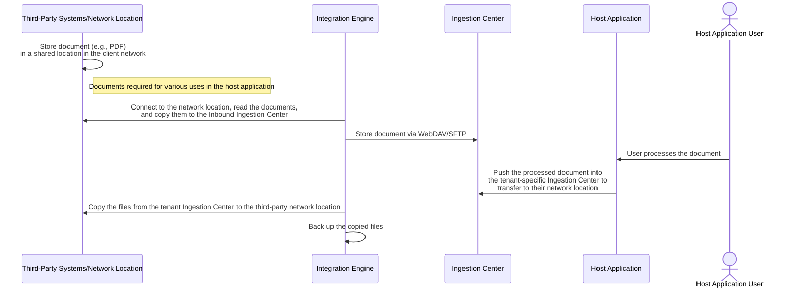

# Integration Engine (IE)

The Integration Engine module handles message exchanges between the systems it
operates on and third-party systems. The expected features the engine suppors
are given below,

| Features/Uses                         | Details                                                                                                                                                                                                                                                                                                     |
| ------------------------------------- | ----------------------------------------------------------------------------------------------------------------------------------------------------------------------------------------------------------------------------------------------------------------------------------------------------------- |
| Ingestion Center                      | Capable of placing files in the ingestion center's Inbound and Outbound folders using technologies such as WebDAV, SFTP, and virtual printer capabilities.                                                                                                                                                  |
| Message format/standard Support       | The Integration Engine primarily supports message standards like HL7, FHIR, JSON, and XML but can also handle a variety of file types for exchange, such as CSV, Excel, or custom formats. This includes tasks like sending tenant-specific SQL dumps for application-specific data to third-party systems. |
| Direct SQL access to Customer systems | Supports connecting to customer or client systems' databases via SQL to facilitate information exchange between applications                                                                                                                                                                                |
| Webhooks                              | Able to invoke various webhook APIs of the application where the Integration Engine is used to transmit data retrieved from the third-party database, enabling further processing within different application modules.                                                                                     |

## Ingestion Center

# Ingestion Center and Integration Engine (IE)

## Features and Capabilities

- **Document Exchange:**
  - Both **inbound** and **outbound** document exchanges are supported, with
    WebDAV and SFTP protocols. Virtual printer capability is optionally
    supported.

- **Third-Party Integration:**
  - The Ingestion Center facilitates two-way document exchange between the
    application utilizing the Integration Engine and various third-party
    applications, primarily different EHR (Electronic Health Records) systems.

- **Security and Compliance:**
  - The Ingestion Center securely exchanges documents and complies with HIPAA
    regulations.

- **Ease of Setup:**
  - The Ingestion Center allows for easy setup and file transfer using network
    mounting with WebDAV or other methods.

- **Tenant-Specific Configuration:**
  - Each Ingestion Center is identified with a unique ID, username, and
    password, ensuring that the centers are tenant-specific and enabling secure
    file sharing with simple file copy methods, requiring minimal technical
    knowledge.

- **Advanced Integration:**
  - Advanced features are also supported, such as integration with Mirth-based
    HL7 platforms or IoT integration platforms.

- **Custom Workflows:**
  - Custom workflows can be developed using workflow engine tools like Node-RED
    (or other programming platforms) and integrated with the Integration Engine
    (IE) codebase for extended functionality.

## Message Handling

- **Message Transfer Support:**
  - The Ingestion Center supports transferring various types of messages, such
    as custom JSON or FHIR JSON, which are generated from the application to
    third-party systems (e.g., on-premises EHRs), through:
    - Direct message delivery within their network
    - Processing the message and inserting/updating data in the EHR's database

- **Message Generation Support:**
  - It also supports message generation in either custom JSON or FHIR JSON from
    third-party applications, either by:
    - Generating custom JSON or FHIR JSON by directly retrieving data from the
      customer's on-premises database, converting it into the desired JSON
      format, and sending it to the application platform via the API provided by
      the application where the Integration Engine is utilized
    - Sending custom JSON/FHIR JSON generated by the Integration Engine (IE)
      using data queried from the database, such as patient demographic details,
      progress notes, relative information, and various document metadata

- **Message Delivery:**
  - The Integration Engine sends messages by querying data from the on-premises
    database, converting them into custom JSON/FHIR JSON, and delivering them to
    the application platform through the API.

- **No Business Logic:**
  - The IE does not perform any business logic other than duplicate message
    checking to avoid processing messages that have already been handled.

- **No Ingestion Pipeline Activities:**
  - The IE does not handle ingestion pipeline activities; it solely manages the
    exchange of messages and their archival process.

## Sequence Diagramsof the various use cases

1. **Files Exhange with Third-Party Systems/Network Location**

2. **Files Exhange with Third-Party Systems/Network Location** **TODO:** working
   the sequence diagram

# Resource surveillance (surveilr)

Resource surveillance (surveilr) is a command-line edge tool (single binary)
designed for file monitoring, processing, and ingestion, typically used in data
pipelines or automated workflows. It is often employed to watch specific
directories, detect changes, and trigger actions when files are added, modified,
or removed. The tool can be integrated into various systems where real-time file
handling is crucial, such as data processing applications, automated backup
solutions, and ETL (Extract, Transform, Load) processes.

| Features list                                                                | Details                                                                                                                                                                                                                                                                                                                                                                                                                                                                                                                                                                                                                                                                                                                                                                                                                                                                                                                                                                                                                                                                                                                                                                                                                                                                                                                                                                                                |
| ---------------------------------------------------------------------------- | ------------------------------------------------------------------------------------------------------------------------------------------------------------------------------------------------------------------------------------------------------------------------------------------------------------------------------------------------------------------------------------------------------------------------------------------------------------------------------------------------------------------------------------------------------------------------------------------------------------------------------------------------------------------------------------------------------------------------------------------------------------------------------------------------------------------------------------------------------------------------------------------------------------------------------------------------------------------------------------------------------------------------------------------------------------------------------------------------------------------------------------------------------------------------------------------------------------------------------------------------------------------------------------------------------------------------------------------------------------------------------------------------------ |
| Multi-source data ingestion and complete orchestration in the data pipelines | STDOUT content, SQL content, Single files and archives, IMAP (emails) yml, HL7, FHIR, JSON, CSV, XML, Product Lifecycle Management (PLM) systems, Conversations (Twitter, Discord, Slack, etc.)                                                                                                                                                                                                                                                                                                                                                                                                                                                                                                                                                                                                                                                                                                                                                                                                                                                                                                                                                                                                                                                                                                                                                                                                        |
| Feature at a glance                                                          | **File Monitoring:** surveilr continuously monitors specified directories for any file changes, such as additions, deletions, or modifications. It can be configured to watch multiple directories simultaneously. It works idempotently even in large number of files and folders.  **Ingestion (File and Task):** _File ingestion_ reads and processes files from a file system into a structured database for monitoring and analysis, we can do transformation as needed, and storing them in a database. _Task Ingestion_ helps us to automate the execution of shell tasks, transforming the outputs into structured JSON data that is inserted into the uniform_resource table in the RSSD.  **Custom Commands and Actions (capturable executable):** Users can define custom actions that surveilr should perform when a file event occurs. These actions might include executing scripts, moving files, or triggering other programs using the ingested output to the input of other task or scripts etc. CEs allow you to pass in arguments or behaviors to the ingest command that allows certain patterns of files to be executed in a safe shell, and their STDOUT and STDERR captured and stored in uniform_resource. These scripts are referred to as _capturable executables_ or CEs and are influenced through _Processing Instructions_ (PIs) in file names. |
| Data transformation capabilities                                             | Multiple transformation types also supported by surveilr examples, XML to JSON conversion, YAML and TOML processing, CSV handling, Excel workbook processing.                                                                                                                                                                                                                                                                                                                                                                                                                                                                                                                                                                                                                                                                                                                                                                                                                                                                                                                                                                                                                                                                                                                                                                                                                                          |
| Advanced data processing Integration capabilities                            | _**Uniform resource tables (RSSD)**_ Bespoke SQL views, Built-in convenience SQL views, Bespoke Tables etc., Multiple integration capabilities, FDW (pull), DuckDB (push via ATTACH), SQLPage, SQLite RSSPs, ETL/ELT support.                                                                                                                                                                                                                                                                                                                                                                                                                                                                                                                                                                                                                                                                                                                                                                                                                                                                                                                                                                                                                                                                                                                                                                       |
| Compatibility with various presentation layers                               | Pgweb, DBeaver, PostgREST, platformatic.dev etc...                                                                                                                                                                                                                                                                                                                                                                                                                                                                                                                                                                                                                                                                                                                                                                                                                                                                                                                                                                                                                                                                                                                                                                                                                                                                                                                                                     |
| OS/Platform                                                                  | Windows, macOS and Linux                                                                                                                                                                                                                                                                                                                                                                                                                                                                                                                                                                                                                                                                                                                                                                                                                                                                                                                                                                                                                                                                                                                                                                                                                                                                                                                                                                               |
