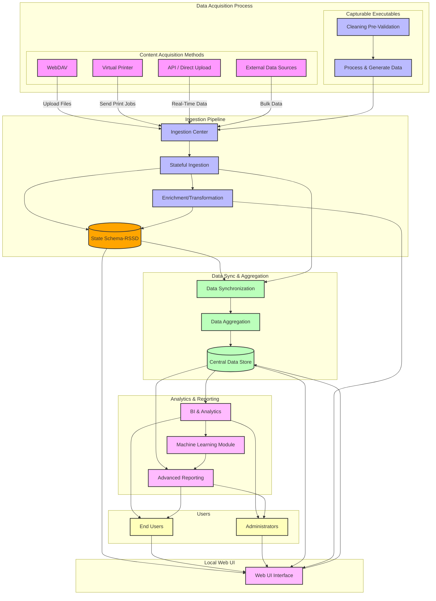
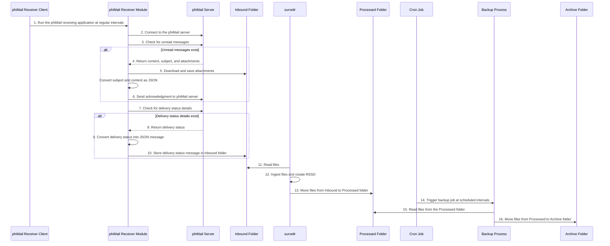

# Resource Surveillance Integration Engine (`RSIE`) for Local-first Edge-based Stateful Data Aggregation

### Table of Contents

- [Resource Surveillance Integration Engine (`RSIE`) for Local-first Edge-based Stateful Data Aggregation](#resource-surveillance-integration-engine-rsie-for-local-first-edge-based-stateful-data-aggregation)
 
  - [Introduction to the Resource Surveillance Integration Engine (RSIE)](#introduction-to-the-resource-surveillance-integration-engine-rsie)
  - [Electronic Data Exchange Overview](#electronic-data-exchange-overview)
  - [Resource Surveillance Integration Engine (`RSIE`) features and use cases](#resource-surveillance-integration-engine-rsie-features-and-use-cases)
  - [Resource Surveillance Integration Engine (RSIE) Ingestion/Integration Pipeline](#resource-surveillance-integration-engine-rsie-ingestionintegration-pipeline)
    - [Real-Time and Offline Processing](#real-time-and-offline-processing)
    - [Improved Reliability](#improved-reliability)
    - [Security and Compliance](#security-and-compliance)
  - [Separation of Content Acquisition and Stateful Ingestion](#separation-of-content-acquisition-and-stateful-ingestion)
    - [Content Acquisition](#content-acquisition)
    - [Stateful Ingestion](#stateful-ingestion)
    - [Data Synchronization and Aggregation](#data-synchronization-and-aggregation)
  - [Content Acquisition: Flexible Methods](#content-acquisition-flexible-methods)
  - [Capturable Executables for Enhanced Data Preparation](#capturable-executables-for-enhanced-data-preparation)
    - [Data Validation and Sanitization](#data-validation-and-sanitization)
    - [File Naming Pattern for Capturable Executables (CEs)](#file-naming-pattern-for-capturable-executables-ces)
  - [Stateful Ingestion](#stateful-ingestion-1)
    - [Key Functions of Stateful Ingestion](#key-functions-of-stateful-ingestion)
    - [Data Storage](#data-storage)
    - [Stateful Context Management](#stateful-context-management)
  - [Web UI for Viewing Ingested Data](#web-ui-for-viewing-ingested-data)
  - [Data Synchronization and Aggregation](#data-synchronization-and-aggregation-1)
    - [Key Functions](#key-functions)
    - [Advanced Analytics and Reporting](#advanced-analytics-and-reporting)
    - [Integration with Other Systems](#integration-with-other-systems)
    - [Data Quality and Governance](#data-quality-and-governance)
  - [Technical Summary](#technical-summary)
  - [Various Use Cases and Sequence Diagrams](#various-use-cases-and-sequence-diagrams)
    - [Direct Messaging Service](#direct-messaging-service)
      - [Overview](#overview)
  - [Resource surveillance (surveilr)](#resource-surveillance-surveilr)

## Introduction to the Resource Surveillance Integration Engine (RSIE)

The **Resource Surveillance Integration Engine (RSIE)** is a stateful data
preparation and integration platform for multiple systems that need to integrate
and operate on common data in a local-first, edge-based manner.

- Stateful means that the RSIE is not just passing data between multiple sytems
  but allows storing the data in an opinionated universal schema with full SQL
  querying support.
- Local-first means that content should be prepared and processed locally
  _before_ going to a cloud or central server.
- Edge-based means that data should be handled as close to where the data is
  collected rather than everything being done centrally.

A typical use for RSIE's stateful, local-first, edge-based is for complex
medical data integration tasks. While RSIE can help with almost any integration
tasks, RSIE is particularly useful to help integrate **clinical operations
data**, **patient data**, **pharmacy** and **billing information** to and from
multiple systems.

RSIE supports a variety of technologies to ensure smooth communication and data
transfer. It provides opinionated architecture and design guidance for file
placement in designated ingestions folders using technologies like **WebDAV**,
**SFTP**, and **virtual printers**. It works with various message formats
including **HL7**, **FHIR**, **JSON**, and **XML**, while also supporting file
types such as **CSV**, **Excel**, and custom formats. The module can connect
directly to customer systems via **SQL** for database-level exchanges, and it
integrates with webhook APIs to trigger actions based on data retrieved from
third-party databases.

In addition to simplifying data exchange processes, RSIE's local-first,
stateful, edge-based architecture helps reduce sensitive data exposure
(HIPAA-compliance) by allowing data to be anonymized or deidentified before
going to central servers.

The Integration Engine operates through a small, yet powerful and easy
manageable application that resides on any device like a phone, workstations and
laptop PCs, or servers in the cloud with highly secure environment. Its primary
role is to collect data from the host systems (the system where the data
originates), and securely transmit designated third-party systems, it also
collect/process data from the third party system and transfer the same to the
source systems in a secure way. This process is fundamental to ensuring that
sensitive healthcare data is shared safely and efficiently across different
platforms.

## Electronic Data Exchange Overview

**Integration Engine (IE)** utilizes a secure and reliable data exchange method,
ensuring that all patient information is transmitted in compliance with industry
standards. The system supports:

1. **Clinical Operating and Patient Data**: This requires managing patient data
   for various uses within the **Digital Health Technology Solution** to support
   ultimate patient care, coordination, and other operational tasks to ensure
   smooth delivery of services and patient satisfaction.

2. **Patient medication and continuity of care (COC) Data**: Facilitating the
   exchange of patient treatment plans, progress notes, and other clinical
   information with the partner EHR system and also transfer of patient
   demograhics and billing, progress notes and other information which is
   required to do the various steps/activities in the clinical workflows.

3. **Patient Billing/Pharmacy, refill Information**: Data exchange in this
   category deals with the exchange of data related to medication/prescription,
   delivery of medicine, and various billing and forms data generated by
   practice systems, as well as data transferred from third-party EHR systems to
   streamline activities involved in patient care.

4. **Data exchange standards for interoperability**: In order to ensure a
   universal data standard, Integration Engine uses common message standards for
   data exchange, which include HL7, FHIR, JSON, XML, CSV, PDF, XLS, and direct
   exchange using Webhooks/APIs between practice systems and third-party
   systems.

The integration of these data types within practice systems will enhance
efficiency and effectiveness through an integrated platform, ensuring that
patient care is delivered with the highest level of accuracy, security, and
patient satisfaction, benefiting from real-time data exchange that supports
high-quality patient care.

## Resource Surveillance Integration Engine (`RSIE`) features and use cases

The various functional components/layers of the Resource Surveillance
Integration Engine (RSIE) are given below,

| Components/Layers                        | Details                                                                                                                                                                                                                                                                          |
| ---------------------------------------- | -------------------------------------------------------------------------------------------------------------------------------------------------------------------------------------------------------------------------------------------------------------------------------- |
| Acquisition of Content (Data)            | Steps involves in the content acquisition i.e preparation of the files/data for ingestion. Inaddition to the local files, we can use technologies such as WebDAV, SFTP, AWS S3, Git and Virtual Printer capabilities are the part of this layer.                                                                               |
| Advanced Data Acquisition Layer          | This layer helps users for enhanced data preparation using Capturable Executables(CEs). With the support of processing instructions (PI) Capturable Executables(CEs) further helps the user to prepare data with specific message standards like JSON,plain/text etc              |
| Message format/standard Support          | The Resource Surveillance Integration Engine supports a wide range of standards like HL7, FHIR, JSON, and XML but can also handle a variety of file types for exchange, such as CSV, Excel, or custom formats.                                                           |
| Stateful Ingestion                       | Involves the steps of ingesting and processing data into a structured universal schema with full SQL querying support. RSIE leverages state tables to track the status of ingested files, ensuring that files are not re-ingested unless changes are detected. This approach prevents redundant ingestion, optimizes performance, and supports incremental updates. By maintaining the state of ingested data, RSIE ensures efficient data management, scalability, and transparency, while also providing a clear audit trail of the ingestion history.                                                                                                                                                      |
| Web UI for Viewing Ingested Data Locally | Resource Surveillance Integration Engine (RSIE) provides a Web UI component that allows users to view ingested data in real time and access data processed offline                                                                                                               |
| Data Synchronization and Aggregation     | The Data Synchronization and Aggregation phase involves systematically synchronizing and aggregating the ingested and processed data into a central data store. This ensures the data is ready for advanced analytics, reporting, and integration with other supporting systems. |

## Resource Surveillance Integration Engine (RSIE) Ingestion/Integration Pipeline

The **Resource Surveillance Integration Engine (RSIE)** is designed to support
both real-time and offline/batch processing. It ensures flexible and scalable
data integration across various healthcare systems and other sectors. The
ingestion/integration processes are divided into several key phases, each
focused on maximizing performance, security, and reliability for both immediate
and delayed data processing and querying.

RSIE’s local-first edge-based architecture allows for distributed, scalable
processing. It handles both real-time data streams and larger batch processing
loads without overwhelming the central infrastructure.

### Real-Time and Offline Processing

- **Real-Time Processing:** The system is capable of processing data as it
  arrives in real-time.
- **Offline/Batch Processing:** It also supports offline/batch processing on
  data.

### Improved Reliability

RSIE’s ability to store and batch-process data ensures continuous functionality,
because of its edge-based nature, i.e., it processes data close to its origin.

### Security and Compliance

Whether handling real-time data or batch uploads, RSIE maintains strict security
protocols, anonymizing sensitive information before transmission and ensuring
compliance with standards like HIPAA.

## Separation of Content Acquisition and Stateful Ingestion

RSIE separates the data acquisition phase from the stateful ingestion process,
allowing for modular control and optimized handling. This distinction enhances
both real-time and offline batch processing, enabling the system to continuously
and efficiently capture, ingest, and store data in a stateful manner.

### Content Acquisition

Data is collected using several methods, including:

- **WebDAV**: It enables data acquisition through WebDAV, allowing users to
  upload files and data directly into designated ingestion locations or folders.
  This facilitates seamless file transfers from various source systems or data
  origins.
- **Virtual Printers**: Allows capturing print jobs (e.g., reports or documents)
  and storing them in designated ingestion folders for further processing.
- **API, Direct Uploads and local file systems**: Supports both real-time API
  data feeds and batch uploads of bulk data from external sources, cloud storage
  (e.g., Amazon S3, SFTP, Git, IMAP, and Direct Messaging Services).

These methods ensure that RSIE can handle both on-demand, real-time data
integration and batch processing for periodic uploads or delayed data
preparation and ingestion.

### Stateful Ingestion

Once acquired, data moves to the stateful ingestion layer, where it is
processed, transformed, enriched, and stored in a universal schema. This layer
supports both real-time ingestion for immediate analysis and offline processing
for batch jobs.

**File Ingestion**

File ingestion in RSIE involves importing and processing files from a file system into a Resource Surveillance State Database (RSSD) for monitoring and analysis, a process known as "walking the filesystem." This method scans directories and files, extracting their metadata and content to be stored in the RSSD.

**Preparing for Ingestion**

Before starting the ingestion process, it's important to determine which files and directories will be processed. surveilr provides an option that simulates the process without making any changes, ensuring that only the desired files are ingested. This feature is particularly useful for previewing files in the current working directory or specified directories before actual ingestion.

**Performing File Ingestions**

Files can be ingested either from the current working directory (CWD) or specific directories using the -r flag. Users can also utilize regular expressions to target specific directories or files. Ingestion can be followed by displaying statistics on the ingested data using the --stats option, which provides insights into the volume and type of data processed.

Command examples include:

  - Ingesting all files from the CWD or specific directories.
  -  Previewing files before ingestion.
  -  Displaying statistics post-ingestion to analyze the ingested content.

**Task Ingestion**

Task ingestion in RSIE allows users to automate the execution of shell tasks and convert their outputs into structured JSON data, which is stored in the uniform_resource table of the Resource Surveillance State Database (RSSD).

RSIE task ingestion allows running one or more Deno Task Shell commands through STDIN, executing them sequentially. The outputs are formatted as JSON (or another specified format) and inserted into the database. Inputs can be either:

  -  **Simple Text:** Non-JSONL text treated as an anonymous command string, executed with the assumption that the output will be in JSON format.
  -  **JSONL Format:** Text in JSONL format, where each object contains specific attributes. The value of the key is executed as a command, and the output is stored using the key as an identifier.

**IMAP Email Ingestion**

IMAP Email Ingestion in RSIE enables the direct ingestion of IMAP emails into the Resource Surveillance State Database (RSSD). This feature automates the process of retrieving emails from a specified folder and batch size, converting them into structured JSON data, and storing them in the ur_ingest_session_imap_acct_folder_message table of the RSSD.

It works with any email provider that supports IMAP, and for Microsoft 365 users, RSIE offers integration guidance through the Microsoft Graph API, ensuring comprehensive email data access.

### Data Synchronization and Aggregation

After ingestion, RSIE synchronizes and aggregates processed data to a central
data store. This ensures that both real-time and batch data are available for
further processing, analysis, and reporting, allowing central systems to perform
advanced analytics or integrations with other systems.

## Content Acquisition: Flexible Methods

RSIE supports multiple content acquisition methods, enabling data collection
from various sources and modes:

- **WebDAV**: Facilitates seamless file transfers from different source systems.
- **Virtual Printers**: Captures print jobs for later processing.
- **API and Direct Uploads**: Handles real-time API data feeds and batch uploads
  of bulk data from sources like S3 buckets, SFTP, Git, and IMAP.

## Capturable Executables for Enhanced Data Preparation

In typical ingestion pipelines, RSIE ingests files stored in specific locations
and creates the **Resource Surveillance State Database (RSSD)**. When the source
of ingestion is processed output from a data source, RSIE leverages **Capturable
Executables (CEs)** to enhance data preparation. These executables tasks/safe
scripts that produce the data and in a more special cases do data transformation
and validation tasks as part of the data preparation pipeline.

### Data Validation and Sanitization

CEs ensure that both real-time/offline data streams and batch files meet
necessary quality standards. They perform tasks such as:

- **Transformation**: Converts real-time and batch data into standardized
  formats.
- **Automation**: Triggers real-time and offline tasks, ensuring efficient data
  processing.

### File Naming Pattern for Capturable Executables (CEs)

Capturable Executables (CEs) are scripts that can be run with specific arguments
or behaviors to produce output files, which are then captured and stored in the
surveillance state database. These scripts are managed through Processing
Instructions (PIs) embedded in their file names.

The naming pattern for CEs allows for flexible execution and capture of results
produced by these scripts. This further enable more control to the user to meet
specific data preparation requirement in the ingestion process.

The file name pattern mainly uses a regular expression, like
surveilr\[(?P<nature>[^]]*)\] and a few common file name patterns and its
meaning are given below,

`<filename>.surverilr[json]` – this pattern expect to produce JSON output as the
result of capturable executable.

`<filename>.surverilr[txt]` – this pattern expect to produce plain text output
as the result of capturable executable.

`<filename>.surverilr[xyz]` – this pattern is a general notation where `[xyz]`
is the required output data format. Eg. yml,md, etc.

## Stateful Ingestion

The Stateful Ingestion phase is a pivotal component of the data processing
pipeline in RSIE. It is responsible for handling data once it has been acquired
from various sources. In this phase, data is processed, enriched, and stored in
a standardized format, ensuring that it is ready for both real-time and offline
analysis. The stateful nature of this layer allows it to maintain the context
and state of data throughout the ingestion process, supporting seamless and
efficient data management.

### Key Functions of Stateful Ingestion

- **Data Parsing**: Converts raw data into a structured format that can be
  easily processed. This may include parsing different data formats such as
  JSON, XML, CSV) etc.
- **Validation**: Checks data for correctness and completeness. Invalid or
  incomplete data is flagged for review or correction.
- **Transformation**: Applies transformations to standardize data, such as
  converting units, normalizing values, or mapping fields to a common schema.
- **Enrichment**: Enhances data by adding supplementary information or context.
  This might include merging data from multiple sources or applying business
  rules to add derived fields.

The capabilities of the Resource Surveillance Integration Engine (RSIE) can be extended at multiple levels:
-	**Content-Level Extensibility:**
RSIE allows for extensibility at the content level through capturable executables. These scripts generate data in various formats, such as JSON, plain text, or others, which are then ingested and stored in the RSIE state schema, specifically in the uniform_resource table of the Resource Surveillance State Schema.
- **SQL DDL-Level Extensibility:**
Capturable executables can also include SQL Data Definition Language (DDL) scripts to create tables or other SQLite database objects, offering extensibility at the database schema level.
- **Programmatic/Scriptable Extensibility with Integrated TypeScript Integration:**
RSIE supports programmatic extensibility through integrated TypeScript or Deno tasks. These scripts can be customized to generate the necessary output for ingestion, making RSIE highly adaptable to specific business requirements. This extensibility enables the development of custom logic and workflows to produce data tailored to unique functional needs.
### Data Storage

Processed data is stored in a **universal schema**, a standardized format that ensures consistency across datasets. This schema, known as the Resource Surveillance State Database (RSSD), facilitates easy querying, analysis, and integration.

A Resource Surveillance State Database (RSSD) is a versatile and independent data source created through surveilr, which can be utilized across various tools, services, applications, or integrated into data warehouses once generated. Its independence allows for flexible usage in any computing environment that supports SQLite, enabling seamless integration into different systems and workflows. RSSD is designed to automate the collection of evidence such as code, test results, emails, issues/tickets, and wikis, ensuring compliance with security, privacy, safety, and regulatory standards through machine attestation rather than manual processes.
To generate an RSSD, the surveilr ingest command can be used for file or task ingestion. For instance, navigating into a directory and running surveilr ingest files will create an RSSD in the target folder. Alternatively, using the -r flag allows ingestion of content from a specified directory without changing directories. The resulting resource-surveillance.sqlite.db file will contain several tables storing the state data.
In environments with multiple RSSDs, it is important to configure unique identifiers for each database, which can be achieved by appending unique elements such as hostnames to the database filename. This can be done either by setting an environment variable (SURVEILR_STATEDB_FS_PATH) or passing a unique identifier using the -d flag during ingestion. These methods help manage and merge RSSDs across environments, ensuring that each database is easily identifiable.
The individual RSSD can be merged when we need to aggregate the data for more detailed analysis and integrated into external application or use for data warehouses.

### Stateful Context Management

RSIE ensures end-to-end orchestration of the ingestion pipeline, maintaining the
context of data throughout its lifecycle. Key features include:

- **Session Management**: Tracks data sessions for continuity.
- **State Management**: Maintains the state of data throughout the ingestion
  process, preserving context and tracking changes. This is crucial for handling
  updates, managing version history, and ensuring data integrity.

## Web UI for Viewing Ingested Data

RSIE provides a Web UI for users to view ingested data in real-time or access
processed offline data. Key features include:

- **Data Visualization**: The Web UI module enable easy configurable web
  components to view the ingested data locally.
- **Querying Capabilities**: Full SQL querying support enables users to extract
  and analyze data from both real-time and batch ingestion sources.
- **Audit and Traceability**: The UI includes tracking features that provide
  visibility into both real-time and batch data flows, ensuring compliance and
  security audits are easily conducted.

## Data Synchronization and Aggregation

The **Data Synchronization and Aggregation** phase is the final and critical
step in the RSIE pipeline. After data has been ingested and processed through
various stages, this phase ensures that the data is systematically synchronized
and aggregated into a central data store. This final step consolidates both
real-time and batch-processed data, making it accessible for advanced analytics,
reporting, and integration with other supporting systems.

### Key Functions

- **Data Synchronization**: Ensures real-time and batch data are consistently
  updated in the central repository.
- **Data Aggregation**: Consolidates data from different sources into a unified
  structure.
- **Data Transformation**: Applies transformations to standardize data formats,
  ensure consistency, and enrich the data (e.g., merging fields, calculating
  metrics). The data transformation also include anonymizing sensitive
  information before the transmission.

### Advanced Analytics and Reporting

Consolidated data enables sophisticated analysis and reporting through:

- **Business Intelligence (BI)**: Data visualization tools and dashboards.
- **Predictive Analytics**: Analyzes historical data to forecast trends.
- **Custom Reporting**: Generates tailored reports based on user requirements.

### Integration with Other Systems

RSIE facilitates data exchange across different systems through:

- **APIs**: Provides APIs for external systems to access aggregated data.
- **Data Export**: Exports data in formats like CSV and JSON.

### Data Quality and Governance

RSIE maintains accuracy, consistency, and reliability through:

- **Data Validation**: Ensures data correctness before synchronization.
- **Audit Trails**: Tracks changes and updates to maintain transparency.
- **Compliance**: Adheres to data privacy and regulatory standards such as
  **GDPR** and **HIPAA**.

## Technical Summary

The following diagram depicts the overall architecture of the Resource
Surveillance Integration Engine (RSIE) in the data acquisition, ingestion, transformation, visualization, aggregation, and synchronization pipeline.

## Various Use Cases and Sequence Diagrams

### Direct Messaging Service

#### Overview

Direct messaging service is a secure messaging service that facilitates the
exchange of protected health information (PHI) in compliance with healthcare
regulations like HIPAA. It is designed to support healthcare providers,
organizations, and other stakeholders in securely transmitting health-related
data, ensuring both privacy and integrity.

Health information is exchanged securely between various Electronic Health
Records (EHR) systems using email-like messages. These messages include contents
and attachments. The attachments typically consist of medical or discharge
summaries. A Continuity of Care Document (CCDA) is also often included as an
attachment, which contains comprehensive patient information such as medication,
vitals, allergies, lab tests, prescriptions, and provider notes. This
illustrates the various steps involved in integration workflows, which include
data acquisition, ingestion, transformation, visualization, synchronization, and
application integration.

## Resource surveillance (surveilr)

Resource surveillance (surveilr) is a command-line edge tool (single binary)
designed for file monitoring, processing, and ingestion, typically used in data
pipelines or automated workflows. It is often employed to watch specific
directories, detect changes, and trigger actions when files are added, modified,
or removed. The tool can be integrated into various systems where real-time file
handling is crucial, such as data processing applications, automated backup
solutions, and ETL (Extract, Transform, Load) processes.

| Features list                                                                | Details                                                                                                                                                                                                                                                                                                                                                                                                                                                                                                                                                                                                                                                                                                                                                                                                                                                                                                                                                                                                                                                                                                                                                                                                                                                                                                                                                                                                 |
| ---------------------------------------------------------------------------- | ------------------------------------------------------------------------------------------------------------------------------------------------------------------------------------------------------------------------------------------------------------------------------------------------------------------------------------------------------------------------------------------------------------------------------------------------------------------------------------------------------------------------------------------------------------------------------------------------------------------------------------------------------------------------------------------------------------------------------------------------------------------------------------------------------------------------------------------------------------------------------------------------------------------------------------------------------------------------------------------------------------------------------------------------------------------------------------------------------------------------------------------------------------------------------------------------------------------------------------------------------------------------------------------------------------------------------------------------------------------------------------------------------- |
| Multi-source data ingestion and complete orchestration in the data pipelines | STDOUT content, SQL content, Single files and archives, IMAP (emails) yml, HL7, FHIR, JSON, CSV, XML, Product Lifecycle Management (PLM) systems, Conversations (Twitter, Discord, Slack, etc.)                                                                                                                                                                                                                                                                                                                                                                                                                                                                                                                                                                                                                                                                                                                                                                                                                                                                                                                                                                                                                                                                                                                                                                                                         |
| Feature at a glance                                                          | **File Monitoring:** surveilr continuously monitors specified directories for any file changes, such as additions, deletions, or modifications. It can be configured to watch multiple directories simultaneously. It works idempotently even in large number of files and folders.  **Ingestion (File and Task):** _File ingestion_ reads and processes files from a file system into a structured database for monitoring and analysis, we can do transformation as needed, and storing them in a database. _Task Ingestion_ helps us to automate the execution of shell tasks, transforming the outputs into structured JSON data that is inserted into the uniform_resource table in the RSSD.  **Custom Commands and Actions (capturable executable):** Users can define custom actions that surveilr should perform when a file event occurs. These actions might include executing scripts, moving files, or triggering other programs using the ingested output to the input of other task or scripts etc. CEs allow you to pass in arguments or behaviors to the ingest command that allows certain patterns of files to be executed in a safe shell, and their STDOUT and STDERR captured and stored in uniform_resource. These scripts are referred to as \_capturable executables_ or CEs and are influenced through _Processing Instructions_ (PIs) in file names. |
| Data transformation capabilities                                             | Multiple transformation types also supported by surveilr examples, XML to JSON conversion, YAML and TOML processing, CSV handling, Excel workbook processing.                                                                                                                                                                                                                                                                                                                                                                                                                                                                                                                                                                                                                                                                                                                                                                                                                                                                                                                                                                                                                                                                                                                                                                                                                                           |
| Advanced data processing Integration capabilities                            | _**Uniform resource tables (RSSD)**_ Bespoke SQL views, Built-in convenience SQL views, Bespoke Tables etc., Multiple integration capabilities, FDW (pull), DuckDB (push via ATTACH), SQLPage, SQLite RSSPs, ETL/ELT support.                                                                                                                                                                                                                                                                                                                                                                                                                                                                                                                                                                                                                                                                                                                                                                                                                                                                                                                                                                                                                                                                                                                                                                        |
| Compatibility with various presentation layers                               | Pgweb, DBeaver, PostgREST, platformatic.dev etc...                                                                                                                                                                                                                                                                                                                                                                                                                                                                                                                                                                                                                                                                                                                                                                                                                                                                                                                                                                                                                                                                                                                                                                                                                                                                                                                                                      |
| OS/Platform                                                                  | Windows, macOS and Linux                                                                                                                                                                                                                                                                                                                                                                                                                                                                                                                                                                                                                                                                                                                                                                                                                                                                                                                                                                                                                                                                                                                                                                                                                                                                                                                                                                                |
