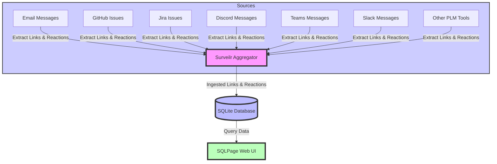

# Netspective Lectio Product Strategy Document

## Introduction

In today’s rapidly evolving business landscape, the ability to efficiently
disseminate, retain, and apply knowledge is more critical than ever. However,
traditional methods of sharing knowledge—such as emailing links, PDFs, or other
resources—are often ineffective, particularly in B2B environments where roles,
disciplines, and subject areas vary widely.

Netspective Lectio is a cutting-edge, team-based reading assignment and content
collaboration solution designed to address these challenges. By integrating
advanced tracking mechanisms, role-based content sharing, and continuous
education tools, Lectio ensures that knowledge is not only shared but also
understood and acted upon.

Netspective Lectio is designed to revolutionize team-based knowledge sharing and
collaboration by addressing the inefficiencies of traditional methods. By
offering robust tools for creating, tracking, and applying knowledge, Lectio
ensures that organizations can keep pace with the growing demands of knowledge
management.

The integration of `surveilr` within Lectio’s architecture enhances its
capabilities, allowing for comprehensive data aggregation and analysis across
multiple sources. This data strategy, combined with advanced tracking mechanisms
and role-based content sharing, positions Lectio as an essential tool for any
organization looking to enhance its knowledge management processes.

Lectio’s targeted approach—catering to specific roles, disciplines, and subject
areas—ensures that knowledge is not only disseminated effectively but also
applied in a way that drives tangible results. With a strong focus on continuous
education and effectiveness tracking, Lectio is poised to become a cornerstone
of modern knowledge management strategies.

## Market Research and Problem Statement

### The Knowledge Sharing Challenge

As organizations grow and evolve, the need for efficient knowledge sharing
across teams becomes paramount. Traditional methods of sharing knowledge often
fail due to several key issues:

- **Lack of Visibility:** Once a link or resource is shared, it’s difficult to
  track who has seen or engaged with it.
- **No Engagement Metrics:** There is no straightforward way to determine if the
  content was opened, read, or understood.
- **Overload of Information:** Professionals are often inundated with content,
  leading to information being ignored or forgotten.
- **Absence of Accountability:** Without mechanisms to track engagement, there’s
  no accountability for whether the content was consumed or applied.
- **One-Size-Fits-All Approach:** Sharing all content with all colleagues,
  regardless of relevance to their role, discipline, or expertise, leads to
  inefficiencies and disengagement.

### Why Netspective Lectio is Needed

Lectio is designed to overcome these challenges by providing a targeted,
structured, and trackable approach to knowledge sharing:

- **Continuous Team-Based Education:** Lectio ensures that knowledge management
  is not ad hoc but continuous and integrated into daily workflows.
- **Role-Based Content Sharing:** Content is shared based on the recipient’s
  role, discipline, and subject area, ensuring relevance and engagement.
- **Longitudinal Tracking of Effectiveness:** By tracking reading assignments
  and their impact, Lectio ensures that knowledge dissemination is both
  effective and actionable.
- **Centralized Knowledge Sharing:** Lectio centralizes knowledge from multiple
  sources, organizing it by teams, topics, and other relevant categories.
- **Action-Oriented Knowledge Management:** Lectio tracks not only who reads the
  content but also who understands it and takes necessary actions based on that
  knowledge.

### The Challenge of Information Overload in Newsletters and RSS Feeds

In addition to the traditional challenges of link sharing, professionals are
often inundated with content from newsletters and RSS feeds. While these sources
are valuable for staying informed, they often include a large volume of
information, making it difficult for busy professionals to identify and
prioritize the most important content.

Without the assistance of AI or other advanced analytical tools, critical
information can be easily overlooked. This problem is compounded when the
content is shared without context or actionable insights, leading to missed
opportunities for learning and application.

Lectio addresses this issue by leveraging AI and other analytical tools to
highlight the most relevant content for each role or discipline, ensuring that
important information is not missed amidst the noise.

## Product Vision

Netspective Lectio is positioned as the premier solution for team-based reading
assignments and content collaboration, with a focus on efficient knowledge
dissemination and retention. The product is designed to be the easiest way for
organizations to create team reading assignments, track the effectiveness of
knowledge sharing, and understand who is acting upon the knowledge versus who is
not.

Lectio goes beyond traditional content sharing methods by integrating AI-driven
analysis to prioritize and highlight the most critical information. This ensures
that busy professionals can stay informed without being overwhelmed by the
volume of content.

### Core Promises

- **Increase Knowledge from More Sources:** Lectio empowers organizations to
  increase knowledge from diverse sources, including newsletters and RSS feeds,
  while using AI to filter and prioritize the most relevant information.
- **Easiest Way to Create and Track Reading Assignments:** Lectio simplifies the
  creation of team reading assignments and provides robust tools to track their
  completion and effectiveness.
- **Track Knowledge Sharing Effectiveness:** Lectio provides insights into how
  well knowledge is being shared, understood, and applied across the
  organization.
- **Apply the Knowledge Gained:** By tracking actions taken based on the
  knowledge shared, Lectio ensures that learning translates into tangible
  results.

## Key Features

### Create Team Reading Assignments

- **Organize by Group:** Lectio allows users to organize reading assignments by
  teams, topics, disciplines, regulatory requirements, compliance needs, etc.
- **Collect from Multiple Systems:** Assignments can be gathered from various
  sources like emails, Slack, Discord, GitHub Issues, and more, centralizing all
  relevant content.
- **Role-Based Assignments:** Assign reading assignments based on job roles,
  professional disciplines, or specific project requirements.

### Track Reading Assignments

- **Monitor Completion:** Lectio provides tools to see exactly who has read the
  assigned content and who has not.
- **Custom Tracking Metrics:** Use reactions, quizzes, and acknowledgments to
  track not only whether the content was read but also whether it was understood
  and acted upon.
- **Tracking by Subject and Discipline:** Use analytics tools to track
  engagement by subject area and professional discipline, ensuring that the
  right content reaches the right people.

### Track Knowledge Sharing Effectiveness

- **Engagement Analytics by Role/Discipline:** Track engagement with shared
  content, including who opened, read, and commented on assignments, broken down
  by job role, professional discipline, and subject area.
- **Effectiveness Reports:** Generate reports that show the effectiveness of
  knowledge sharing, highlighting areas where further education may be needed.
- **Feedback Loops per Subject Area:** Implement feedback mechanisms where staff
  can rate the usefulness of the content and provide comments, refining future
  content sharing strategies tailored to specific subject areas.

### Apply the Knowledge Gained

- **Track Actions Taken:** Monitor the actions taken by team members after
  consuming the content, ensuring that the knowledge gained is applied
  effectively.
- **Annotation and Commentary:** Readers can rate, score, annotate, and comment
  on their assignments, providing insights into their understanding and
  application of the content.
- **Highlighting Role-Specific Action Items:** Clearly outline any action items
  that are particularly relevant to certain roles or disciplines, ensuring they
  are addressed by the appropriate staff.

### Advanced Tracking Mechanisms

- **Custom Reactions per Role/Discipline:** Implement custom reactions or emojis
  that indicate not just that the content was read, but also whether it was
  understood and if any action items were generated. For example, a ✅ might
  indicate "Read," a 🧠 could indicate "Understood," and a ⚡ might indicate
  "Action Required."
- **Mandatory Acknowledgments by Role:** Require staff in certain roles to
  acknowledge that they have read and understood critical documents or watched
  important training videos. This can be enforced through simple forms or
  platform-specific acknowledgment features.

### Content Summarization and Key Takeaways by Discipline

- **Discipline-Specific Summaries:** Provide tailored summaries that highlight
  the most relevant points for different roles or disciplines. This ensures that
  even if the full content isn’t consumed immediately, the essential information
  for that group is communicated.
- **Scheduled Check-ins by Team:** Conduct follow-ups in team meetings or
  one-on-one check-ins to discuss how the shared content applies to their
  specific roles and ensure understanding.
- **Discipline-Specific Discussion Channels:** Create discussion channels
  focused on specific professional disciplines, where staff can discuss the
  shared content, share their insights, and ask questions relevant to their
  roles.

## Integration Architecture and Data Strategy

`surveilr` is a sophisticated tool designed to inspect file systems, read and
aggregate email content, and gather data from Product Lifecycle Management (PLM)
tools like GitHub, GitLab, and OpenProject. It also integrates with messaging
platforms such as Discord, Slack, Microsoft Teams, and email systems. As it
ingests this data, `surveilr` compiles it into an SQLite database—a lightweight
and versatile database solution that serves as the cornerstone of Lectio’s
stateful data strategy.

### SQLite as the Core Data Store

- **Data Ingestion:** As `surveilr` inspects various content sources, it
  compiles the gathered data into an SQLite database. This database acts as a
  centralized repository for the monitored data, making it easily accessible for
  querying and analysis within Lectio.
- **Link Aggregation:** One of the primary functions of `surveilr` within the
  Lectio framework is to extract links from all ingested sources (emails,
  messages, PLM tools, etc.) and compile them into a structured, queryable
  format.

### Querying and Analysis via SQL

- **SQL Query Interface:** All content aggregated by `surveilr`—including links,
  reactions, comments, and other metadata—can be queried directly via SQL. This
  provides Lectio with the ability to perform complex data analysis, generate
  reports, and track the effectiveness of knowledge sharing across the
  organization.
- **Custom Queries:** Users can create custom SQL queries to analyze specific
  aspects of the aggregated data, such as tracking which links have been most
  widely shared, which content has generated the most engagement, or which teams
  are lagging in their knowledge consumption.

### Integration with Lectio’s Tracking and Reporting Features

- **Data-Driven Insights:** The integration of `surveilr` with Lectio enables
  real-time data-driven insights into how content is being consumed and acted
  upon. This integration supports Lectio’s key features, such as tracking
  reading assignments, monitoring engagement by role and discipline, and
  generating effectiveness reports.
- **Scalability and Flexibility:** The use of SQLite as the core data store
  ensures that Lectio’s data strategy is both scalable and flexible, allowing it
  to adapt to the varying needs of different organizations and teams.

### Potential for Canonical Data Store

- **Optional Canonical Data Store:** While the stateful data management approach
  via SQLite is sufficient for most use cases, organizations with more complex
  data requirements or those needing a centralized, canonical data store can opt
  to implement one. This canonical store could be integrated with the existing
  SQLite database, providing a more robust solution for long-term data retention
  and compliance needs.
