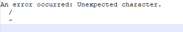

# FAQ

**1.** When the script
`deno run -A https://raw.githubusercontent.com/opsfolio/resource-surveillance-commons/main/service/diabetes-research-hub/drhctl.ts 'foldername'`,
is executed ,the following error is received. How to resolve this?



This issue may be caused by a version change or caching to Deno. To resolve the
issue, follow these steps:

1. Clear the cache by running the following command:

   ```bash
   deno cache --reload https://raw.githubusercontent.com/opsfolio/resource-surveillance-commons/main/service/diabetes-research-hub/drhctl.ts
   ```

2. After clearing the cache, run the single execution command:

   ```bash
   deno run -A https://raw.githubusercontent.com/opsfolio/resource-surveillance-commons/main/service/diabetes-research-hub/drhctl.ts 'foldername'
   ```

- Replace `foldername` with the name of your folder containing all CSV files to
  be converted.

This should resolve the issue and allow the script to execute correctly.
