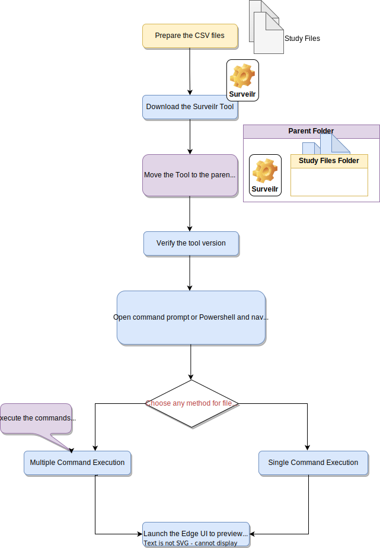

# Surveilr DRH Data Transformation and SQLPage Preview Guide

## Overview

Welcome to the Surveilr DRH Data Transformation and SQLPage Preview guide! This
tool allows you to securely convert your CSV files, perform de-identification,
and conduct verification and validation (V&V) processes behind your firewall.
You can view the results directly on your local system. The following steps will
guide you through converting your files, performing de-identification, V&V, and
verifying the data all within your own environment.

### Requirements for Previewing the Edge UI:

1. **Surveilr Tool** (use version `0.12.2` or `0.13.4`)
2. **Deno Runtime** (requires `deno` v1.40 or above):
   [Deno Installation Guide](https://docs.deno.com/runtime/manual/getting_started/installation/)

Installation steps may vary depending on your operating system.

## Getting Started

You can perform file conversion in two ways:

1. **Multiple Command Execution**: Refer
   [the section](#multiple-command-execution).
2. **Single Command Execution** (suitable for Windows Command Prompt and
   PowerShell): To use the automated script, refer to the
   [Single Command Execution](#single-command-execution).



### Step 1: Navigate to the Folder Containing the Files

- Open the command prompt and navigate to the directory with your files.
- Command: `cd <folderpath>`
- Example: `cd D:/DRH-Files`

### Step 2: Download Surveilr

- Follow the installation instructions at the
  [Surveilr Installation Guide](https://docs.opsfolio.com/surveilr/how-to/installation-guide).
- Download version `surveilr 0.12.2` or `surveilr 0.13.4` from
  [Surveilr Releases](https://github.com/opsfolio/releases.opsfolio.com/releases)
  to this folder.

### Step 3: Verify the Tool Version

- Run the command `surveilr --version` in command prompt and
  `.\surveilr --version` in powershell.
- If the tool is installed correctly, it will display the version number.

## Multiple Command Execution:

### Ingest and Transform the Files

**Command:**

```bash
surveilr ingest files -r `foldername`/ && surveilr orchestrate transform-csv
```

Example:

```bash
surveilr ingest files -r study-files/ && surveilr orchestrate transform-csv
```

**Note:** Replace `study-files` with the name of your folder containing all CSV
files to be converted. Here It is a sub folder within `DRH-Files`.

### Verify the Transformed Data

- Check the folder directly to view the transformed database.
- You should see a SQLite database named `resource-surveillance.sqlite.db`.

### Perform De-identification

```bash
surveilr orchestrate -n "deidentification" -s https://raw.githubusercontent.com/opsfolio/resource-surveillance-commons/main/service/diabetes-research-hub/de-identification/drh-deidentification.sql
```

### Perform Verification and Validation

```bash
surveilr orchestrate -n "v&v" -s https://raw.githubusercontent.com/opsfolio/resource-surveillance-commons/main/service/diabetes-research-hub/verfication-validation/orchestrate-drh-vv.sql
```

### Preview Content with SQLPage

```bash
surveilr orchestrate -n "v&v" -s https://raw.githubusercontent.com/opsfolio/resource-surveillance-commons/main/service/diabetes-research-hub/ux.auto.sql
```

```bash
surveilr web-ui --port 9000
```

- Launch your browser and go to
  [http://localhost:9000/drh/index.sql](http://localhost:9000/drh/index.sql).

## Single Command Execution

You can run everything with a single command:

**Command:**

```bash
deno run -A https://raw.githubusercontent.com/opsfolio/resource-surveillance-commons/main/service/diabetes-research-hub/drhctl.ts 'foldername'
```

**Example:**

```bash
deno run -A https://raw.githubusercontent.com/opsfolio/resource-surveillance-commons/main/service/diabetes-research-hub/drhctl.ts study-files
```

- Replace `foldername` with the name of your folder containing all CSV files to
  be converted.

- After the above command completes execution launch your browser and go to
  [http://localhost:9000/drh/index.sql](http://localhost:9000/drh/index.sql).

This method provides a streamlined approach to complete the process and see the
results quickly.

**Note:** If you encounter any issues using the automated script, please refer
to the [FAQ.md](FAQ.md) for troubleshooting.

# Try it out in this repo (Steps for the developer)

The following SQL scripts will be used:

- drh-deidentification.sql: De-identifies sensitive columns in the study data.
- stateless-drh-surveilr.sql: Creates database views for SQLPage preview.
- orchestrate-drh-vv.sql: Performs verification and validation on the study data
  tables.

**Note**: Reference sample files can be found in the repository folder:
/service/diabetes-research-hub/study-files.zip

First, prepare the directory with sample files and copy them to this folder, or
extract the sample files and move them to this folder:

```bash
$ cd service/diabetes-research-hub
```

The directory should look like this now:

```
├── de-identification
|   ├──drh-deidentification.sql
├── study-files
│   ├── author.csv
│   ├── publication.csv
│   └── ...many other study files    
├── verfication-validation
|   ├──orchestrate-drh-vv.sql
├── stateless-drh-surveilr.sql
├── generate-raw-cgm-web-ui-pages.sql
```

Now
[Download `surveilr`](https://docs.opsfolio.com/surveilr/how-to/installation-guide/)
into this directory, then ingest and query the data:

```bash
# ingest and transform the CSV files in the "study-files/" directory, creating resource-surveillance.sqlite.db
$ surveilr ingest files -r study-files/ && surveilr orchestrate transform-csv
```

````
```bash
# Apply de-identification
$ cat de-identification/drh-deidentification.sql| surveilr orchestrate -n "deidentification"
````

```bash
# Perform verification and validation
$ cat verfication-validation/orchestrate-drh-vv.sql | surveilr orchestrate -n "v&v"
```

After ingestion, you will only work with these files:

```
├── stateless-drh-surveilr.sql    
└── resource-surveillance.sqlite.db            # SQLite database
```

Post-ingestion, `surveilr` is no longer required, the `study-files` directory
can be ignored, only `sqlite3` is required because all content is in the
`resource-surveillance.sqlite.db` SQLite database which does not require any
other dependencies.

```bash
# load the "Console" and other menu/routing utilities   
$ deno run -A ./ux.sql.ts | sqlite3 resource-surveillance.sqlite.db


# if you want to start surveilr embedded SQLPage in "watch" mode to re-load files automatically
$ ../../support/bin/sqlpagectl.ts dev --watch . --watch ../../prime
# browse http://localhost:9000/ to see web UI

# if you want to start a standalone SQLPage in "watch" mode to re-load files automatically
$ ../../support/bin/sqlpagectl.ts dev --watch . --watch ../../prime --standalone
# browse http://localhost:9000/ to see web UI

# browse http://localhost:9000/drh/index.sql
```

Once you apply `drh-deidentification.sql` and `orchestrate-drh-vv.sql` you can
ignore those files and all content will be accessed through views or `*.cached`
tables in `resource-surveillance.sqlite.db`. The `stateless-drh-surveilr.sql`
shall be executed within the ux.sql.ts file itself. At this point you can rename
the SQLite database file, archive it, use in reporting tools, DBeaver, DataGrip,
or any other SQLite data access tools.

## Automatically reloading SQL when it changes

On sandboxes during development and editing of `.sql` or `.sql.ts` you may want
to automatically re-load the contents into SQLite regularly. Since it can be
time-consuming to re-run the same command in the CLI manually each time a file
changes, you can use _watch mode_ instead.

See: [`sqlpagectl.ts`](../../support/bin/sqlpagectl.ts).
